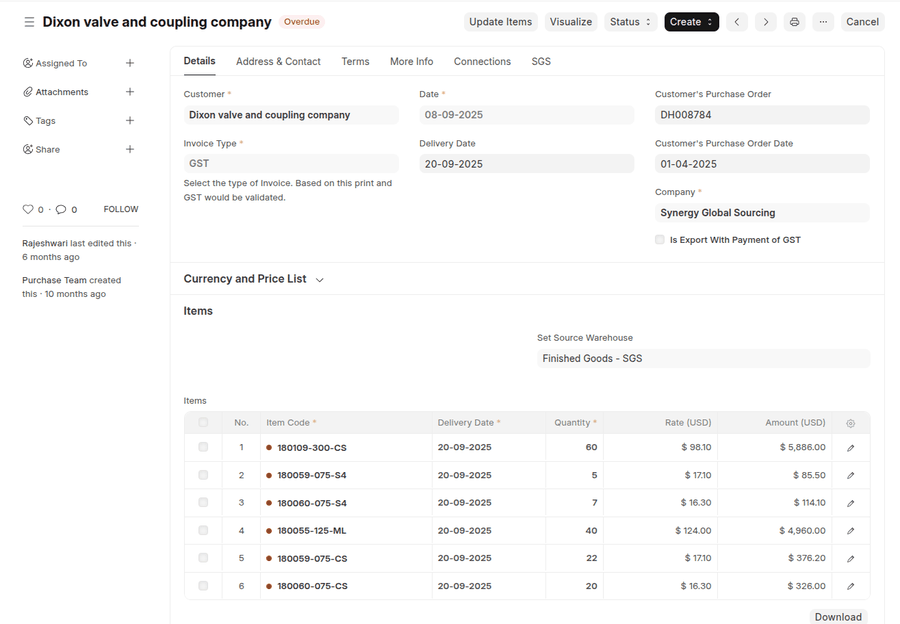
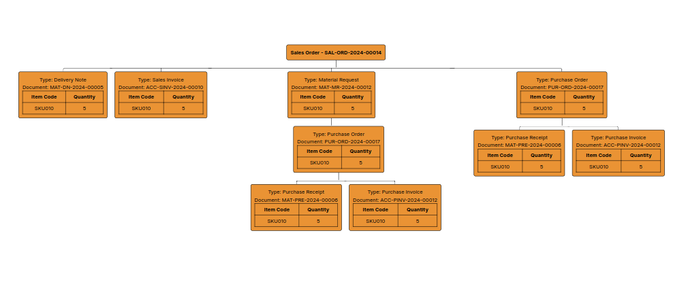

# AmPower Visualize

### See how everything connects.

**Interactive, zoomable traceability for documents, items, and batches in Frappe / ERPNext.**

[](LICENSE)
[](https://frappeframework.com/)
[](https://erpnext.com/)



---

AmPower Visualize is a powerful tool designed to enhance document traceability and visualize document relationships within your Frappe/ERPNext system. This application provides an interactive, zoomable, and draggable graph view of linked documents, allowing users to explore and understand complex document hierarchies with ease.

Empower your business with clear, interactive document traceability using AmPower Visualize!

## Why AmPower Visualize?

This tool is built for users who deal with orders placed on a daily basis and often face challenges in tracing the status, quantities, or items within a Sales Order. AmPower Visualize bridges this gap by offering an intuitive, visual representation of linked documents, making it easier for businesses to streamline operations and improve traceability.

It can be used for the following use-cases:

1. **Enhanced Traceability**: Quickly trace the origin and flow of products or documents, improving quality control traceability.
2. **Improved Decision Making**: Visualize relationships for better-informed decisions.
3. **Efficient Troubleshooting**: Identify dependencies and resolve issues faster.
4. **User-Friendly Interface**: Accessible for both technical and non-technical users.
5. **Generalized Use Cases**: Applicable across industries for diverse document types.

## Visualization Modes
AmPower Visualize offers powerful visualization modes to cater to different traceability needs:

#### Document Level Visualization
Creates a hierarchical radial graph of a root document (e.g. Sales Order) and every linked document connected to it — Delivery Notes, Sales Invoices, Purchase Orders, Purchase Receipts and more — grouped by Sales Order Item. Click any node to open a side panel showing its status, items, and quantities, with a direct link to open the document in Frappe.



#### Document Traceability Demo
Generates detailed graphs showing parent-child relationships between documents
Displays how documents are linked across different transactions
Ideal for tracking specific documents through your business processes


## Batch Traceability

> **One batch in, the whole story out.** Batch Traceability turns the Stock Ledger into a living lineage graph — follow any batch backwards to its raw-material origins and forwards through every repack, manufacture, and transfer it ever touched.


Where the Document Traceability traces *document* links, Batch Traceability traces the **physical movement of stock itself**. It reads directly from the Stock Ledger Entry (SLE) and Serial and Batch Bundle data — the single source of truth for every quantity that ever moved — so the graph reflects what actually happened in your warehouses, not just what was filed on paper.

Open it from the **Batch Traceability** page in your system.

### What you get

- **Bidirectional lineage** — trace **Ancestors** (where a batch came from), **Descendants** (what it became), or **Both** in a single graph.
- **Voucher-aware nodes** — every hop is labelled with the actual document that moved the stock, including the Stock Entry subtype (Repack, Manufacture, Material Transfer, …).
- **Depth-coloured rings** — edges are colour-coded by how many lineage hops they sit from the batch you searched, with a live legend, so distance reads at a glance.
- **Click to expand** — click any batch node to walk one more level on demand; the graph grows in place and keeps your viewport anchored.
- **Voucher side-panel** — click a voucher to see every inward/outward movement it recorded: warehouse, quantity, batch, and timestamp, one row per movement.
- **Smart truncation** — busy vouchers (e.g. a Repack feeding dozens of batches) collapse to the most relevant batches with a `+N` badge; expand or re-truncate from the panel at any time.
- **Date-bounded tracing** — optional From / To datetime filters scope the lineage to a window using native Frappe controls.
- **Fuzzy multi-token search** — type a few letters or numbers from the batch name *or* its item; every token just has to match somewhere.
- **Fluid canvas** — pan, zoom-to-cursor, drag individual nodes, and fit-to-screen, all in a full-bleed layout.

### How it works

Search a batch and press **Trace**. AmPower Visualize reads your actual stock movements and draws the batch at the centre, with every batch it came from on one side and everything it turned into on the other. Each connection is labelled with the document that moved the stock — a Repack, a Manufacture, a Transfer — so you can see not just *what* is related, but *how*.

From there it's interactive: click any batch to grow the graph one step further, click a connecting document to see exactly what moved through it, and pan, zoom, or drag to explore. Because it works the same way for every kind of stock movement, you get one consistent view whether you're tracing a simple transfer or a multi-stage manufacturing chain.

## Requirements

Before installing AmPower Visualize, ensure your environment meets the following minimum requirements:
- **Frappe**: v15.103.2 (version-15)
- **ERPNext**: v15.102.0 (version-15)

## How It Works

### Installation

To install AmPower Visualize in your Frappe/ERPNext instance:

1. **Clone and Install**:
bench get-app https://github.com/Ambibuzz/ampower_visualize.git
bench install-app ampower_visualize
```

Then run `bench setup requirements` to install the JS dependencies, followed by `bench build` to bundle the assets.

You can also follow [this](https://discuss.frappe.io/t/install-custom-app-from-github/23458) guide.

2. **Troubleshooting Common Installation Issues**:
If you encounter issues during installation, try running the following series of commands:
```bash
   supervisorctl restart all
   bench restart
   supervisorctl restart all
   bench setup supervisor
   supervisorctl reread
   supervisorctl update
   bench restart
```
3. **Navigate**: Access the "Document / Batch Traceability" page in your system.
4. **Select and Visualize**:
    - Select a DocType (e.g., Sales Order) from the dropdown menu.
    - Choose a specific document to begin visualization.
    - Ensure the document hierarchy exists (e.g., a Sales Invoice must be created from a Sales Order) for accurate visualization.
5. **Interactive Exploration**:
    - The graph starts with a root node as the center representing the selected document.
    - Use zoom and pan to navigate large document hierarchies.
    - The meaning of each node can be read from the legend created on top of the graph.
    - Every node represents the document where a particular item is referenced.
    - The edge of each node represents the status of the parent document where the reference is found, along with the quantity of the item.
    - The link on each node can be clicked to navigate to that particular document in Frappe.

### Key functions:
1. **`get_graph_data`**:
- Fetches linked documents from the backend using `frappe.call`.
- Constructs a JSON structure with `nodes` and `edges` for the graph renderer.

2. **`render_graph` (Document Traceability)**:
- Builds the graph using a custom SVG radial layout:
  - **Nodes**: Represent documents (e.g., Sales Orders, Sales Invoices, Delivery Notes).
  - **Edges**: Define relationships between documents, labelled with quantities.
- Supports zoom, pan, drag, and a side panel for node details.
- Uses an adaptive radial fan layout for dynamic, collision-free positioning.

3. **`visualize_graph` (Item & Batch Traceability)**:
- Builds the graph using D3.js ([LICENSE](https://github.com/d3/d3/blob/main/LICENSE)):
  - **Nodes**: Represent items or batches.
  - **Links**: Define relationships between nodes.
- Adds zoom, pan, and drag functionality for intuitive navigation.
- Uses force-directed layout for dynamic positioning.

### Customizations:

**Document Traceability** uses a custom SVG engine with an adaptive radial layout — no external graph library required. Node positions, fan angles, and radii are computed from the document hierarchy returned by the backend.

**Item and Batch Traceability** use **D3.js**, a powerful JavaScript library, to render force-directed graphs. The library consumes JSON data from the backend and creates a graphical representation on that basis.

- Node colors and sizes vary by document type.
- A legend helps users identify node types and their significance.
- Edges include labels indicating document status and quantities for respective items.

## Future Scope

AmPower Visualize has a range of planned enhancements to further improve its functionality and user experience:

- [ ] **Enhanced Node Display** — Refine the UI to encapsulate document names and relevant fields within each node, providing clearer information at a glance.
- [ ] **Customizable Node Fields** — Configure which document fields are displayed in each node, tailoring the visualization to specific needs.
- [ ] **Document Status Indicators** — Show the status of each document (e.g., Submitted, Draft, Balance Quantity) directly on the graph.
- [ ] **Draft Inclusion** — Include draft documents in the visualization when applicable.
- [ ] **Manufacturing Workflow Visualization** — Extend support for manufacturing processes, covering workflows such as **Sales Order → Production Plan → Work Order → Job Card**.
- [ ] **Configurable Document Chains** — Define and customize the chain of documents to trace, offering comprehensive flexibility for unique business workflows.
- [ ] **Quantity on Edges** — Surface the moved quantity directly on each lineage edge in the Batch Traceability graph.

## Contributing

We welcome contributions! Check out the GitHub repository for guidelines on how to contribute.

## Support

Encountered an issue? File a ticket on the GitHub repository.

## License

MIT